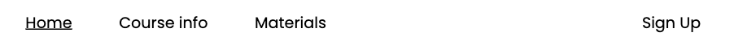
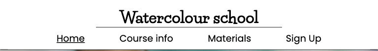
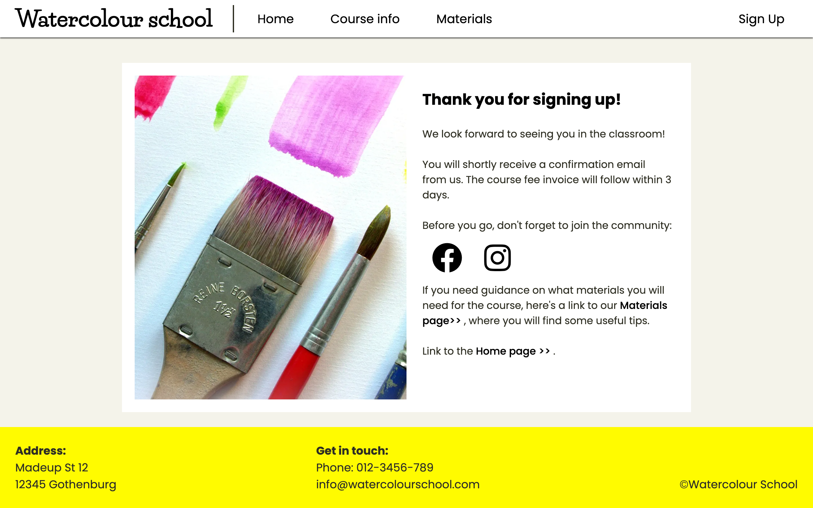

# Watercolour School

The Watercolour School website allows users to learn about the company's beginner's watercolour course. Visitors to the website can read about the course, register for the course, and find information on materials they will need in order to participate in the course.

The site can be accessed by this [link](https://johannacarolinep.github.io/watercolour-school/)

---
## User Stories

### First Time Visitor Goals:

* As a First Time Visitor landing on the home page, I want to be able to quickly understand that this is a Watercolour school website from above-the-fold elements so that I can quickly establish that the website matches my search criteria.

* As a First Time Visitor landing on the home page, I want to be able to understand the theme of the resources from the navigation bar and section headings, so that I can gain an overview of the page resources and decide that they match my expectations.

* As a First Time Visitor landing on the home page, I want to be able to easily navigate through the website, so that I can gain an overview of the information and intuitively understand its structure.

* As a First Time Visitor considering if the course may be of interest to me, I want to see testimonials and/or other social proof of the course, so I can see that the course provider is trustworthy and that other students have found the course useful and/or enjoyable.

* As a First Time Visitor considering if the course may be of interest to me, I want the tone of the website to be encouraging and inspirational, so that I can feel motivated to consider the course.

### Returning Visitor Goals:
* As a Returning Visitor, I want to see more detailed information about the course, its scope and structure, helping me to decide if the course is right for me.

* As a Returning Visitor, I want to see transparent information about pricing, supporting my decision to register for the course.

* As a Returning Visitor, I want to understand what materials I am expected to bring to the course, if I choose to register, so that I can understand what other costs are involved.

* As a Returning Visitor, I want to see community links, so that I can research the course further.

* As a Returning Visitor, I want to see that course registration is available, easy, and quick, so that the registration process does not feel as a big task for me.

* As a Returning Visitor who have signed up for the course, I want to be informed of what happens next, how I will pay for the course and when I will hear from the company, so that I feel safe and know what to expect.

### Frequent Visitor Goals:

* As a Frequent Visitor, I want to be able to find contact details of the organisation, in case I have questions not answered on the website.

## Features

### Header
The header is identical across all pages, containing the logo and the navigation.

#### Logo
The logo is clickable. When on the home page, clicking on the logo will make the page scroll to the top. When on other pages of the website, clicking the logo will take the user to the home page.

#### Navigation
The navigation located at the top of the page allows the user to get to all pages of the website with one click. It contains the following links:

- "Home" - leads to the Home page
- "Course info" - leads to the Course info page
- "Materials" - leads to the Materials page
- "Sign up" - leads to the Sign up page

In order to improve the user experience, a larger area around the link text is clickable.

The current page is underlined.

##### On desktop:
On larger screens (min width 992px) the navigation appears as one row, together with the logo. 

The "Home", "Course info" and "Materials" links are aligned to the left, while the "Sign Up" link is aligned to the right, in order to make the "Sign Up" link stand out from the rest and be easy to find once a user is ready to sign up for the course.

In order to improve the user experience of the navigation, the clickable area around each link will change colour on hover. Additionally there is an animated underline effect, to account for the subtlety of the colour change. 

##### On tablet:
On tablet screen sizes (width 768px - 991px) the navigation is moved to a separate row from the logo. 

The links appear in the same order but are centered.

##### On mobile:
On mobile screens (max-width 767px) a hamburger icon appears on the same row as the logo, on the right side.  

When clicked, the navigation will show as a dropdown menu. 

---

### Footer
The footer is the same across all pages. It contains useful contact information (address, phone, and email) as well as copyright information. 

---

### Home page
The main roles of the home page are:
- to clarify to the  user the purpose of the website
- to provide an overview in an easy-to-consume format
- to inspire and encourage users to consider signing up for the course
- to help the user trust and relate to the course provider through the use of social proof

#### Hero section
The hero section contains a heading that clarifies the purpose of the website, using simple and specific language.

It also contains a link styled as a button, drawing users attention to the possibility to sign up for the course.

The hero section has a fixed background image to draw attention and make the page more visually interesting.

Links styled as buttons are used in several places of the website. These have a bright yellow colour to attract attention. They also react on hover by turning into a darker yellow, and getting a shadow, for a better user experience.

#### Overview section
The overview section contains a heading, a text that introduces the course in a short and easy-to-read format, and a link to the "Course info" page where the user can find more detailed information about the course. 

The text uses an informal and positive tone. It addresses the user directly and focuses on how the course will benefit the user. 

#### Testimonial section
The testimonial section contains a quote from a former student talking warmly about the course, together with their name, and accompanied by a portrait image. 

The section helps to build trust and allows the user to picture relate and picture themselves as a participating in the course.

The visual context is enough for most users to understand that this is a testimonial. The section has a hidden heading, clarifying this for users using a screenreader. 

#### Info box section
The info box section contains 3 cards. Two of the cards offer some key details of the course, in a way that is easy to perceive even if a user is quickly going through the page. The third card contains a call to action with a link to the sign up page. 

Similarly to the testimonial section, the info box section has a hidden heading, to improve the experience for screenreader users.

#### User art section
In the user art section, the company showcases 4 images of nice artwork from previous students. This purpose is to inspire the user to participate in the course, and again to make the course more credible.

Accompanying the user art there is also a call to join the community on social media, with icons linking to the company's Facebook and Instagram page.

---

### Course info page
The course info page contains a longer article, with the purpose of providing a more detailed description of the course, helping users to the decide whether to sign up. 

In order to make the content more digestible, it is split into sections.

#### Heading and intro section
The overarching heading "Detailed Course Information" is to the point and provides clarity, while the next heading is more fun and engaging. To utilize this, the article intro section heading is styled to get more attention, while the overarching heading still serves its purpose of tying together the article (and page) as a whole.

The intro section also contains an introductory text and clarifies to the user that they do not need prior experience for this course.

#### Course details section
The course details section contains key pieces of information for users considering the course and are placed high up the page, as well as styled to draw attention. 

In the Course price card, the text clarifies that materials are not included in the course fee. This is an important clarification since the target audience are mainly complete beginners to watercolour painting, who may not know that this is the norm. 

Here the user is also directed to the Materials page for more guiance and given a shortcut to get there through a link. 

#### Course scope section
The course scope section contains an unordered list of areas/perspectives covered in the course, with a short explanation of each item. The list is accompanied by a relevant image to create visual interest.

#### Course schedule section
The course schedule section is similar to the previous section, in that it helps the user understand what to expect from the course. It is another list but focused on what students will be painting throughout the course, providing a basic course schedule.

In order to make the section stand out from the previous section, visual interest is added in the form of icons, symbolising each of the 5 motif themes.

#### CTA section
Lastly, the article finishes off with a call to action and link to the sign up page, encouraging users to sign up, after they have read more about the course.

---
### Materials page
Aims to set expectations on what materials the user would need to bring to the course.

A secondary purpose is to make this extra cost and task of acquiring the materials less of a hindrance, by giving some price examples, and by providing guidance.

The page has an overall structure of an intro, a list of materials needed, and a page outro.

#### Page intro
Provides a short introduction text, which has an encouraging tone, clarifies again that materials are not included, and sets the stage for the list below.

#### List
The materials list has 4 items, each with its own card on the page. Each list item consists of a clear heading, followed by a text with guidance, and accompanied by a relevant image. 

##### Nested list in the 3rd list item
The third list item, "Watercolour Paints" contains a nested list of the specific paints recommended for the course. This list is styled differently to create more visual interest on the page.

#### Page outro
Lastly, to provide a more natural ending to the page, the list is followed by a brief outro text. To differentiate the page outro from the list items, it has a thick dotted border.

---

### Sign up page
The sign up page has a form, accompanied by an image to make the page more fun.

The first three inputs in the form are required. The third is of the type email and will not accept an input that does not follow the email format. 

The fourth input is a dropdown, allowing the user to select a start date. There is default option, which will be sent with the form if the user does not make an active choice. 

The submit button is styled in the way as the links styled as buttons throughout the website, to create a feeling of coherance. 

Underneath the submit button, there is a text clarifying that submitting the form means the user is registering and will be liable to pay the course fee. On screenreaders, this text is connected to the button by aria-describedby, since it's important that this information is read in connection to the button, instead of after already submitting the form. 

After form submission the user is redirected to the Response page.

---
### Response page
The response page mirrors the sign up page, reusing the image and an almost identical layout, to avoid confusion for the user. 

It contains text confirming the form submission, and sets the expectation on what happens next, to make the user feel safe about the submission.

The response page also contains another encouragement to visit the company's social media, with clickable icons leading to the Facebook and Instagram page.

Lastly the page contains links to the most probably resources the user could want to go to next, the Materials page, in order to prepare for the course, or back to the Home page.

---
## Technologies and tools used

- [HTML](https://developer.mozilla.org/en-US/docs/Web/HTML) was used as the foundation of the site.
- [CSS](https://developer.mozilla.org/en-US/docs/Web/css) - was used to add the styles and layout of the site.
- [Git](https://git-scm.com/) was used for the version control of the website.
- [Balsamiq](https://balsamiq.com/) was used to make wireframes for the website.
- [VSCode](https://code.visualstudio.com/) was used as the main tool to write and edit code.
- [GIMP](https://www.gimp.org/) was used to edit and resize all images.
- [GitHub](https://github.com/) was used to host the code of the website.
- [Colormind](http://colormind.io/) was used to generate the colour scheme for the website.
- [W3C Markup Validation Service](https://validator.w3.org/) was used to validate the HTML code of the website.
- [W3C CSS Validation Service](https://jigsaw.w3.org/css-validator/) was used to validate the CSS code of the website.
- [MacOS VoiceOver](https://support.apple.com/guide/voiceover/welcome/mac) was used to understand screenreader accessibility on the website.
- [Device Shots](https://deviceshots.com/) was used to create mockups of the website for the README.
- [Responsive Viewer](https://chrome.google.com/webstore/detail/responsive-viewer/inmopeiepgfljkpkidclfgbgbmfcennb/related?utm_source=ext_sidebar&hl=en-GB) was used to capture screenshots of the website across different device types.
- [Favicon.io Favicon Generator](https://favicon.io/favicon-generator/) was used to make the favicon for the website

---
## Design

### Colour Scheme

#### Primary colour scheme:

- A bright yellow, #fffb00, was used as the main accent color of the website. Yellow is highly associated with creativity and fun, central to the Watercolour School brand. Yellow is also good at drawing attention, which the website will draw on by using the accent colour somewhat sparingly and for elements that should stand out on the page.

- A mix of soft beige, #f4f3ea, and clean white, #ffffff, were used as background colours. These neutral colours complement the bright yellow accent colour, and helps to give a harmonious impression. Given the purpose of the website, these colours also make for good background colours since they provide a neutral canvas for the often colourful images (e.g. the user art images showcased on the home page).

- A very dark brown, #2e2e22, was used for body text on the website, to give a slightly softer impression, and to allow for the true black, #000000, elements (e.g. headings) to stand out more. 

#### Secondary colours:
In addition to the primary colour scheme, a few more colours were used to a minor extent:
- A dark yellow, #ead200, was used for buttons and links styled as buttons on hover
- rgb(69, 67, 60) was used for a softer shadow effect on hover, and rgb(69, 67, 60) was used for a darker shadow effect on click.
- Lastly an almost white colour with a slight purple tint, rgba(245, 244, 249, 0.786), was used for the hero section overlay, in order to make it semi-transparent. The slight purple tint also helped to make the yellow link stand out better. 

### Typography

- Poppins Google Font was used as the main font throughout the website. This was chosen for high readability of the content.

- Life Savers Google Font was used for the company logo. The intention of choosing Life Savers for this purpose was to attract users' attention to the logo and to communicate the creative nature of the company.

### Wireframes

#### Mobile devices

#### Tablets

#### Desktop

---

## Testing

All test-related documentation can be found in the [TESTING.md](TESTING.md) file.

---

## Deployment

### Deployment to GitHub Pages
The webpages are deployed to GitHub pages, using Git version control. The steps to deployment are as follows:
- In the GitHub repository, navigate to the Settings tab.
- From the source section drop-down menu, select the Main Branch, then click "Save".

Once a push is detected to the Main branch GitHub will update the webpages with the new code in the Main branch.

The live link can be found [here](https://johannacarolinep.github.io/watercolour-school/).

If you wish to run the website locally you can clone it by typing the following command in your IDE Terminal:
- `git clone https://github.com/johannacarolinep/watercolour-school.git`

Once on your local computer, you can open the index.html with a web browser. 

---

## Future improvements

---
## Credits

### Content
- [Shawn Reisner - Codepen.io](https://codepen.io/sreisner/pen/yOOOjx) - This code, with minor adjustments, was used to create the nav link underline effect on hover (on large screens).

### Media
#### Images
All images were taken from [Pixabay](https://pixabay.com/), [Pexels](https://www.pexels.com/), and [Unsplash](https://unsplash.com/).

In order of appearance:
- [Home page - Hero image](https://www.pexels.com/photo/a-used-watercolor-palette-7859492/) (Pexels)
- [Home page - Testimonial section image](https://unsplash.com/photos/woman-in-white-crew-neck-shirt-smiling-IF9TK5Uy-KI) (Unsplash)
- [Home page - 1st image in User Art section](https://pixabay.com/illustrations/paint-flower-floral-spring-blossom-2421585/) (Pixabay)
- [Home page - 2nd image in User Art section](https://pixabay.com/illustrations/watercolor-painting-art-artistic-5852721/) (Pixabay)
- [Home page - 3rd image in User Art section](https://pixabay.com/illustrations/green-tree-forest-nature-3140057/) (Pixabay)
- [Home page - 4th image in User Art section](https://unsplash.com/photos/white-and-orange-cat-painting-KRztl5I6xac) (Unsplash)
- [Course info page - Course details section image](https://pixabay.com/vectors/paint-brush-art-to-paint-painting-4901102/) (Pixabay)
- [Course info page - Course scope image](https://www.pexels.com/photo/a-person-holding-white-paper-with-rainbow-colors-7898407/) (Pexels)
- [Materials page - Watercolor paper section](https://pixabay.com/photos/hands-paint-brush-painting-1868562/) (Pixabay)
- [Materials page - Brushes section](https://pixabay.com/photos/brushes-art-paint-tool-decor-1683134/) (Pixabay)
- [Materials page - Watercolour paints section](https://pixabay.com/photos/tubes-of-paint-art-artists-tools-7761437/) (Pixabay)
- [Materials page - Masking tape section](https://pixabay.com/photos/paint-brush-flat-brush-masking-tape-3175639/) (Pixabay)
- [Sign up and Response pages - Main image](https://pixabay.com/photos/paint-brush-to-paint-colour-4030050/) (Pixabay)

#### Icons
All icons were taken from [Font Awesome](https://fontawesome.com/icons)

#### Fonts
Fonts were imported from [Google Fonts](https://fonts.google.com/)

---

## Acknowledgements
- [Iuliia Konovalova](https://github.com/IuliiaKonovalova) - for all of the valuable guidance and feedback throughout this project. I am incredibly grateful to have such an engaged and knowledgeable mentor. 
- [Code Institute](https://codeinstitute.net/) tutors and Slack community members for their support and help.

---