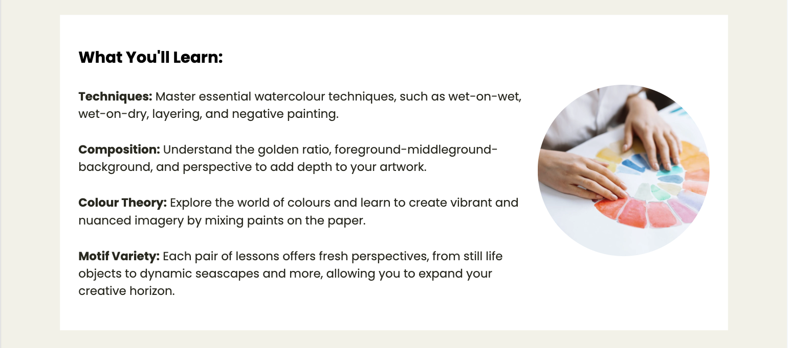
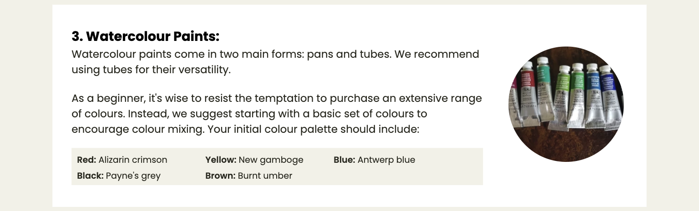

INSERT WATERSCHOOL LOGO HERE

---

# *Watercolour School*

The Watercolour School website allows users to learn about the company's beginner's watercolour course. Visitors of the website can read about the course, register for the course, and find information on materials they will need in order to participate in the course.

The site can be accessed by this [link](https://johannacarolinep.github.io/watercolour-school/)

---
## User Stories

### First Time Visitor Goals:

* As a First Time Visitor landing on the home page, I want to be able to quickly understand that this is a Watercolour school website from above-the-fold elements, so that I can quickly establish that the website matches my search criteria.

* As a First Time Visitor landing on the home page, I want to be able to understand the theme of the resources from the navigation bar and section headings, so that I can gain an overview of the page resources and decide that they match my expectations.

* As a First Time Visitor landing on the home page, I want to be able to easily navigate through the website, so that I can gain an overview of the information and understand its structure in an intuitive way.

* As a First Time Visitor considering if the course may be of interest to me, I want to see testimonials and/or other social proof of the course, so I can see that the course provider is trustworthy and that other students have found the course useful and/or enjoyable.

* As a First Time Visitor considering if the course may be of interest to me, I want the tone of the website to be encouraging and inspirational, so that I can feel motivated to consider the course.

### Returning Visitor Goals:
* As a Returning Visitor, I want to see more detailed information about the course, its scope and structure, helping me to decide if the course is right for me.

* As a Returning Visitor, I want to see transparent information about pricing, supporting my decision to register for the course.

* As a Returning Visitor, I want to understand what materials I am expected to bring to the course, if I choose to register, so that I can understand what other costs are involved.

* As a Returning Visitor, I want to see community links, so that I can research the course further.

* As a Returning Visitor, I want to see that course registration is available, easy, and quick, so that the registration process does not feel as a big task for me.

* As a Returning Visitor who have signed up for the course, I want to be informed of what happens next, how I will pay for the course and when I will hear from the company, so that I feel safe and know what to expect.

### Frequent Visitor Goals:

* As a Frequent Visitor, I want to be able to find contact details of the organisation, in case I have questions not answered on the website.

## Features

### Header

#### Logo

#### Navigation

##### On desktop:

##### On tablet:

##### On mobile:

---

### Footer

---

### Home page

#### Hero section

#### Overview section

#### Testimonial section

#### Info box section

#### User art section

---
+ ### Course info page

#### Heading and intro section

#### Course details section

#### Course scope section

#### Course schedule section

#### CTA section

---
### Materials page

#### Page intro

#### List

##### Nested list in the 3rd list item

#### Page outro

---

### Sign up page

---
### Response page

---
## Technologies and tools used

- [HTML](https://developer.mozilla.org/en-US/docs/Web/HTML) was used as the foundation of the site.
- [CSS](https://developer.mozilla.org/en-US/docs/Web/css) - was used to add the styles and layout of the site.
- [Git](https://git-scm.com/) was used for the version control of the website.
- [Balsamiq](https://balsamiq.com/) was used to make wireframes for the website.
- [VSCode](https://code.visualstudio.com/) was used as the main tool to write and edit code.
- [GIMP](https://www.gimp.org/) was used to edit and resize all images.
- [GitHub](https://github.com/) was used to host the code of the website.
- [Colormind](http://colormind.io/) was used to generate the colour scheme for the website.
- [W3C Markup Validation Service](https://validator.w3.org/) was used to validate the HTML code of the website.
- [W3C CSS Validation Service](https://jigsaw.w3.org/css-validator/) was used to validate the CSS code of the website.
- [MacOS VoiceOver](https://support.apple.com/guide/voiceover/welcome/mac) was used to understand screenreader accessibility on the website.
-[Device Shots](https://deviceshots.com/) was used to create mockups of the website for the README.
- [Responsive Viewer](https://chrome.google.com/webstore/detail/responsive-viewer/inmopeiepgfljkpkidclfgbgbmfcennb/related?utm_source=ext_sidebar&hl=en-GB) was used to capture screenshots of the website across different device types.

---
## Design

### Color Scheme

- Bright yellow was used as the main accent color of the website. Attention and creativity. 

- A mix of soft beige and clean white was used as background colors. Complements the strong accent color. Neutral. Colourful images not clashing with the background. Provides a strong contrast between both text and yelow accent elements such as buttons, and the background. 

- A very dark brown was used for body text on the website, to give a slightly softer impression. 

### Typography

- Poppins Google Font was used as the main font throughout the website. This was chosen for high readbility of the content.

- Life Savers Google Font was used for the company logo. The intention of choosing Life Savers for this purpose was to attract users attention to the logo, and to communicate the creative nature of the company.

### Wireframes

#### Mobile devices

#### Tablets

#### Desktop

---

## Testing

All test related documentation can be found in the [TESTING.md](TESTING.md) file.

---

## Deployment

### Deployment to GitHub Pages
The webpages are deployed to GitHub pages, using git version control. The steps to deployment are as follows:
- In the GitHub repository, navigate to the Settings tab.
- From the source section drop-down menu, select the Main Branch, then click "Save".

Once a push is detected to the Main branch GitHub will update the webpages with the new code in the Main branch.

The live link can be found [here](https://johannacarolinep.github.io/watercolour-school/).

If you wish to run the website locally you can clone it by typing the following command in your IDE Terminal:
- `git clone https://github.com/johannacarolinep/watercolour-school.git`

Once on your local computer you can open the index.html with a web browser. 

---

## Future improvements

---
## Credits

### Content
- [Shawn Reisner - Codepen.io](https://codepen.io/sreisner/pen/yOOOjx) - This code, with minor adjustments was used to create the nav link underline effect on hover (on large screens).

### Media
#### Images
All images were taken from [Pixabay](https://pixabay.com/), [Pexels](https://www.pexels.com/), and [Unsplash](https://unsplash.com/).

In order of appearance:
- [Hero image, Home page](https://www.pexels.com/photo/a-used-watercolor-palette-7859492/) (Pexels)

- [Testimonal section image, Home page](https://unsplash.com/photos/woman-in-white-crew-neck-shirt-smiling-IF9TK5Uy-KI) (Unsplash)

- [1st image in User Art section, Home page](https://pixabay.com/illustrations/paint-flower-floral-spring-blossom-2421585/) (Pixabay)
- [2nd image in User Art section, Home page](https://pixabay.com/illustrations/watercolor-painting-art-artistic-5852721/) (Pixabay)
- [3rd image in User Art section, Home page](https://pixabay.com/illustrations/green-tree-forest-nature-3140057/) (Pixabay)
- [4th image in User Art section, Home page](https://unsplash.com/photos/white-and-orange-cat-painting-KRztl5I6xac) (Unsplash)

- [Course details section image, Course info page](https://pixabay.com/vectors/paint-brush-art-to-paint-painting-4901102/) (Pixabay)

- [Course scope image, Course info page](https://www.pexels.com/photo/a-person-holding-white-paper-with-rainbow-colors-7898407/) (Pexels)

- [Watercolor paper section, Materials page](https://pixabay.com/photos/hands-paint-brush-painting-1868562/) (Pixabay)

- [Brushes section, Materials page](https://pixabay.com/photos/brushes-art-paint-tool-decor-1683134/) (Pixabay)

- [Watercolour paints section, Materials page](https://pixabay.com/photos/tubes-of-paint-art-artists-tools-7761437/) (Pixabay)

- [Masking tape section, Materials page](https://pixabay.com/photos/paint-brush-flat-brush-masking-tape-3175639/) (Pixabay)

- [Main image, Sign up page and Response page](https://pixabay.com/photos/paint-brush-to-paint-colour-4030050/) (Pixabay)

#### Icons
All icons were taken from [Font Awesome](https://fontawesome.com/icons).

---

## Acknowledgments

---