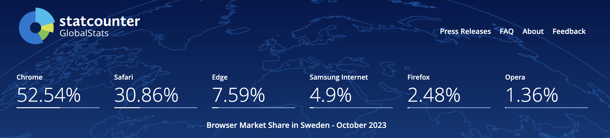

# Testing

## Browser Compatibility

To ensure cross-browser compatibility, the website was reviewed on Chrome, Safari, and Microsoft Edge. These are the three most used browsers in Sweden (the target market for Watercolour School). Additionally, the website was reviewed on Firefox. 

Browser usage in Sweden:

Source: [Statcounter GlobalStats](https://gs.statcounter.com/browser-market-share/all/sweden)

### Screenshots of the website homepage opened on each browser:
- Chrome:

- Safari:

- Microsoft Edge:

- Firefox: 

## Responsiveness
The website responsiveness was checked on numerous device sizes, with Google dev tools as well as the Responsive viewer extension (used to generate the below screenshots).

The below links contain PDF files with screenshots from all web pages across device types:

- [Home page](documentation/home-page.pdf)
- [Course info page](documentation/course-info-page.pdf)
- [Materials page](documentation/materials-page.pdf)
- [Sign up page](documentation/signup-page.pdf)
- [Response page](documentation/response-page.pdf)

## Manual testing

## Lighthouse report

### Home page

### Course info page

### Materials page

### Sign up page

### Response page

## Code validation
### HTML
#### Home page

#### Course info page

#### Materials page

#### Sign up page

#### Response page

### CSS
#### Home page

#### Course info page

#### Materials page

#### Sign up page

#### Response page

## Bugs
### Solved bugs

### Unsolved bugs

### Mistakes