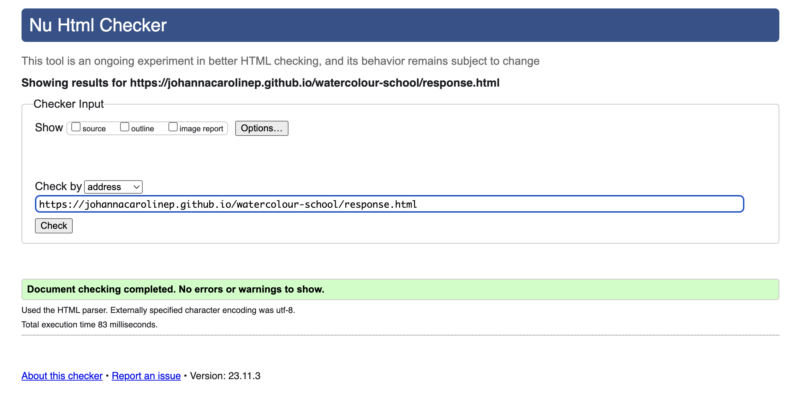

# Testing

## Browser Compatibility

To ensure cross-browser compatibility, the website was reviewed on Chrome, Safari, and Microsoft Edge. These are the three most used browsers in Sweden (the target market for Watercolour School). Additionally, the website was reviewed on Firefox. 

Browser usage in Sweden:

Source: [Statcounter GlobalStats](https://gs.statcounter.com/browser-market-share/all/sweden)

### Screenshots of the website homepage opened on each browser:
- Chrome:

- Safari:

- Microsoft Edge:

- Firefox: 

## Responsiveness
The website responsiveness was checked on numerous device sizes, with Google dev tools as well as the Responsive viewer extension (used to generate the below screenshots).

The below links contain PDF files with screenshots from all web pages across device types:

- [Home page](documentation/home-page.pdf)
- [Course info page](documentation/course-info-page.pdf)
- [Materials page](documentation/materials-page.pdf)
- [Sign up page](documentation/signup-page.pdf)
- [Response page](documentation/response-page.pdf)

## Manual testing
| area | feature | action | expected result | tested | passed | comments |
| --- | --- | --- | --- | --- | --- | --- |
| Header | | | | | | |
| Header | Logo | Click on the logo while on the home page | Scrolls to top of the page | Yes | Yes | - |
| Header | Logo | Click on the logo while on page other than home page | User is directed to the home page | Yes | Yes | - |
| Header | Hamburger icon (mobile screens only) | Click on the hamburger icon | Opens the navigation | Yes | Yes | - |
| Navbar | Home | Click on the "Home" link | The user is redirected to the home page | Yes | Yes | - |
| Navbar | Course info | Click on the "Course info" link | The user is redirected to the Course info page | Yes | Yes | - |
| Navbar | Materials | Click on the "Materials" link | The user is redirected to the Materials page | Yes | Yes | - |
| Navbar | Sign up | Click on the "Sign up" link | The user is redirected to the Sign up page | Yes | Yes | - |
| Home page | | | | | | |
| Hero section | "Sign me up!" link | Click on the "Sign me up!" link | The user is redirected to the Sign up page | Yes | Yes | - |
| Overview section | "Detailed course info >>" link | Click on the "Detailed course info >>" link | The user is redirected to the Course info page | Yes | Yes | - |
| Info box section | "Save me a spot" link | Click on the "Save me a spot" link | The user is redirected to the Sign up page | Yes | Yes | - |
| User art section | Facebook icon | Click on the Facebook icon | The user is redirected to the Facebook page | Yes | Yes | - |
| User art section | Instagram icon | Click on the Instagram icon | The user is redirected to the Instagram page | Yes | Yes | - |
| Course info page | | | | | | |
| Course details section | "Materials page >>" link | Click on the "Materials page >>" link | The user is redirected to the Materials page | Yes | Yes | - |
| Call to action section | "Sign up" link | Click on the "Sign up" link | The user is redirected to the Sign up page | Yes | Yes | - |
| Sign up page | | | | | | |
| Form | First name input | Enter first name | The first name is entered | Yes | Yes | - |
| Form | Last name input | Enter last name | The last name is entered | Yes | Yes | - |
| Form | Email input | Enter email address | The email address is entered | Yes | Yes | If input is not valid email format error message appears |
| Form | Startdate dropdown | If user wants to change from default selection, open by clicking and select start date | A start date is selected | Yes | Yes | If user does not make an active choice, there is a preselected option |
| Form | "Get me signed up!" submit button | Click the "Get me signed up!" submit button | The user is redirected to the response page | Yes | Yes | If any of the required fields, first name, last name, and email input, are omitted, the user is not redirected and a prompt to fill in the missing field appears |
| Response page | | | | | | |
| Response message | Facebook icon | Click on the Facebook icon | The user is redirected to the Facebook page | Yes | Yes | - |
| Response message | Instagram icon | Click on the Instagram icon | The user is redirected to the Instagram page | Yes | Yes | - |
| Response message | "Materials page >>" link | Click on the "Materials page >>" link | The user is redirected to the Materials page | Yes | Yes | - |
| Response message | "Home page >>" link | Click on the "Home page >>" link | The user is redirected to the Home page | Yes | Yes | - |

## Lighthouse report

All web pages' performance and accessibility were assessed using Lighthouse in Google's developer tools.

### Desktop Lighthouse results:

#### Homepage

#### Course info page

#### Materials page

#### Sign up page

#### Response page

### Mobile Lighthouse results:

#### Homepage

#### Course info page

#### Materials page

#### Sign up page

#### Response page

## Code validation
### HTML
No errors were found when validating the web pages with the official W3C HTML Markup Validator.

- Home page

- Course info page

- Materials page

- Sign-up page

- Response page

### CSS
No errors were found when validating the website with the official W3C CSS validator.

## Bugs
### Solved bugs
- When testing the site with Lighthouse, I was alerted that images without a set width and height can cause increased CLS (cumulative layout shift).

    

    Solution: After reading the linked article in the Lighthouse report, I made sure the images' parent containers had a set width. I also added CSS rules targeting the images, with the aspect-ratio property. Running Lighthouse again confirmed this improved the CLS.

- Prioritisation issue in CSS - User art section showing as 100% width on desktops:

    The user art section was showing as 100% width on desktops, while the intended section width was 85%. The behaviour occurred after image optimisation the previous day when one of the steps involved setting the section width to 100% on mobile screens.

    On desktops, the 85% width had previously been set for all sections by targeting the element type. Since I targeted the individual section with a class selector when I set the width on mobile, this width now had precedence. 

    Solution: The width was set to 85% using the class selector for larger screens as well.

- Social media icons showing with a small line between them:

    
    
    Solution: Targeting the social media links with CSS rule text-decoration: none; 

- Incorrectly used "role = menuitem" for navigation links to improve accessibility. 
    When using the WAVE evaluation tool I was alerted to the incorrect use. 
    
    Solution: After reading more about "menuitem", I removed these attributes and values.

### Unsolved bugs
#### Missing form label detected with WAVE Tool:
Using WAVE I found 1 error in the navigation bar on the website: "A form control does not have a corresponding label."

This is related to the checkbox input used to open the dropdown navigation on mobile screens: 
    

Although it is not likely that a lot of screenreader users would be interested in a watercolour course, for future projects it will be more relevant, so fixing this issue is important from a learning perspective. 

##### Steps taken to solve the issue:
- I have tried adding an *aria-label* to the *label* element, but still got the same error.
- I have tried adding an *aria-label* to the *input* element, and still got the error.
- I have tried adding an *aria-label* to the *input* element, while adding *aria-hidden="true"* to the *label* element, and still got the error.
- Finally, I have tried adding an *aria-label* to the *input* element, while adding *aria-labelledby="the id of the input element"* to the *label* element. With this implementation, the error is solved according to the WAVE tool.

##### Steps remaining to solve the bug: 
- Even if the WAVE tool no longer reports an error, I can not be sure the code works as intended, and would need to research the use of aria labels in the context of hamburger menus further to confirm the functionality. 
- Due to time constraints and lack of experience, I will not be able to address this bug fully within the scope of the project. 

### Mistakes

#### Inconsistent naming: 
Throughout most of the project, I named CSS classes using dashes ("-"). Toward the end of the project, I shifted to using underscores ("_") instead, finding it more convenient. This of course resulted in inconsistent naming across the project.

Since I learnt the importance of consistent naming conventions and the effect it has on the readability of the code, I decided to replace the names using underscores in the end, so that all classes are now named consistently, using dashes.