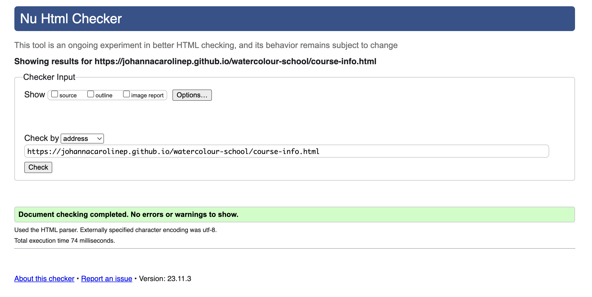
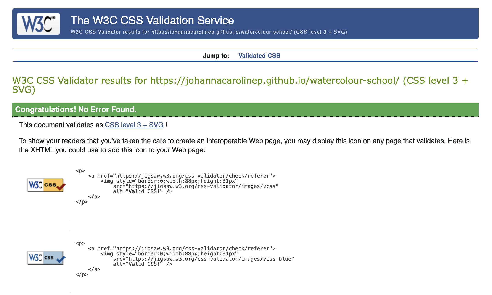

# Testing

## Browser Compatibility

To ensure cross-browser compatibility, the website was reviewed on Chrome, Safari, and Microsoft Edge. These are the three most used browsers in Sweden (the target market for Watercolour School). Additionally, the website was reviewed on Firefox. 

Browser usage in Sweden:

Source: [Statcounter GlobalStats](https://gs.statcounter.com/browser-market-share/all/sweden)

### Screenshots of the website homepage opened on each browser:
- Chrome:

- Safari:

- Microsoft Edge:

- Firefox: 

## Responsiveness
The website responsiveness was checked on numerous device sizes, with Google dev tools as well as the Responsive viewer extension (used to generate the below screenshots).

The below links contain PDF files with screenshots from all web pages across device types:

- [Home page](documentation/home-page.pdf)
- [Course info page](documentation/course-info-page.pdf)
- [Materials page](documentation/materials-page.pdf)
- [Sign up page](documentation/signup-page.pdf)
- [Response page](documentation/response-page.pdf)

## Manual testing
| area | feature | action | expected result | tested | passed | comments |
| --- | --- | --- | --- | --- | --- | --- |
| Header | | | | | | |
| Header | Logo | Click on the logo while on the home page | Scrolls to top of the page | Yes | Yes | - |
| Header | Logo | Click on the logo while on page other than home page | User is directed to the home page | Yes | Yes | - |
| Header | Hamburger icon (mobile screens only) | Click on the hamburger icon | Opens the navigation | Yes | Yes | - |
| Navbar | Home | Click on the "Home" link | The user is redirected to the home page | Yes | Yes | - |
| Navbar | Course info | Click on the "Course info" link | The user is redirected to the Course info page | Yes | Yes | - |
| Navbar | Materials | Click on the "Materials" link | The user is redirected to the Materials page | Yes | Yes | - |
| Navbar | Sign up | Click on the "Sign up" link | The user is redirected to the Sign up page | Yes | Yes | - |
| Home page | | | | | | |
| Hero section | "Sign me up!" link | Click on the "Sign me up!" link | The user is redirected to the Sign up page | Yes | Yes | - |
| Overview section | "Detailed course info >>" link | Click on the "Detailed course info >>" link | The user is redirected to the Course info page | Yes | Yes | - |
| Info box section | "Save me a spot" link | Click on the "Save me a spot" link | The user is redirected to the Sign up page | Yes | Yes | - |
| User art section | Facebook icon | Click on the Facebook icon | The user is redirected to the Facebook page | Yes | Yes | - |
| User art section | Instagram icon | Click on the Instagram icon | The user is redirected to the Instagram page | Yes | Yes | - |
| Course info page | | | | | | |
| Course details section | "Materials page >>" link | Click on the "Materials page >>" link | The user is redirected to the Materials page | Yes | Yes | - |
| Call to action section | "Sign up" link | Click on the "Sign up" link | The user is redirected to the Sign up page | Yes | Yes | - |
| Sign up page | | | | | | |
| Form | First name input | Enter first name | The first name is entered | Yes | Yes | - |
| Form | Last name input | Enter last name | The last name is entered | Yes | Yes | - |
| Form | Email input | Enter email address | The email address is entered | Yes | Yes | If input is not valid email format error message appears |
| Form | Startdate dropdown | If user wants to change from default selection, open by clicking and select start date | A start date is selected | Yes | Yes | If user does not make an active choice, there is a preselected option |
| Form | "Get me signed up!" submit button | Click the "Get me signed up!" submit button | The user is redirected to the response page | Yes | Yes | If any of the required fields, first name, last name, and email input, are omitted, the user is not redirected and a prompt to fill in the missing field appears |
| Response page | | | | | | |
| Response message | Facebook icon | Click on the Facebook icon | The user is redirected to the Facebook page | Yes | Yes | - |
| Response message | Instagram icon | Click on the Instagram icon | The user is redirected to the Instagram page | Yes | Yes | - |
| Response message | "Materials page >>" link | Click on the "Materials page >>" link | The user is redirected to the Materials page | Yes | Yes | - |
| Response message | "Home page >>" link | Click on the "Home page >>" link | The user is redirected to the Home page | Yes | Yes | - |

## Lighthouse report

All web pages' performance and accessibility were assessed using Lighthouse in Google's developer tools.

### Desktop Lighthouse results:

#### Homepage

#### Course info page

#### Materials page

#### Sign up page

#### Response page

### Mobile Lighthouse results:

#### Homepage

#### Course info page

#### Materials page

#### Sign up page

#### Response page

## Code validation
### HTML
No errors were found when validating the web pages with the official W3C HTML Markup Validator.

- Home page

- Course info page

- Materials page

- Sign-up page

- Response page

### CSS
No errors were found when validating the website with the official W3C CSS validator.

## Bugs
### Solved bugs

### Unsolved bugs

### Mistakes